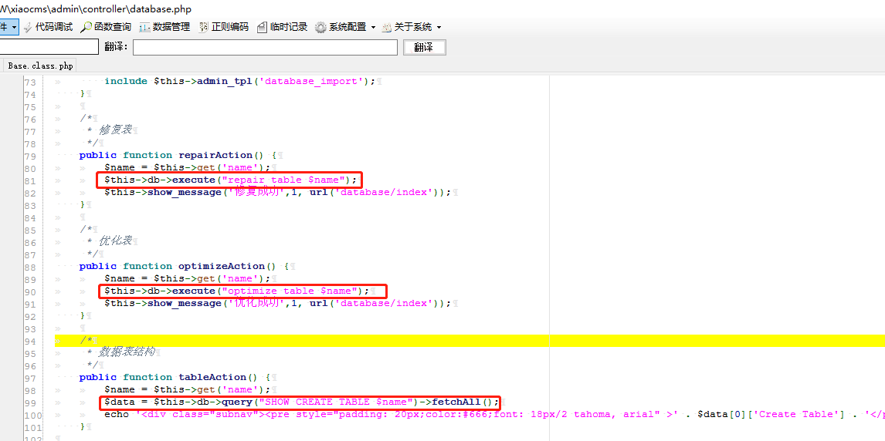
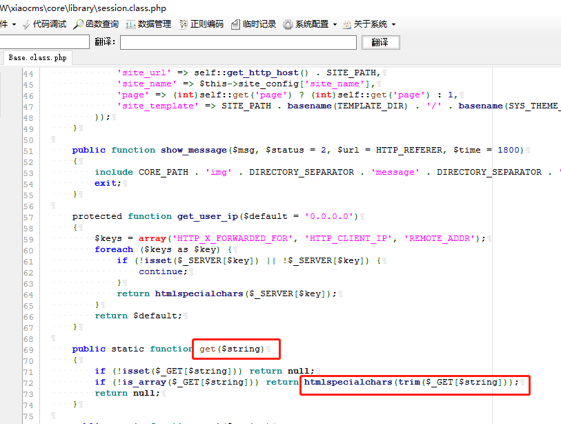
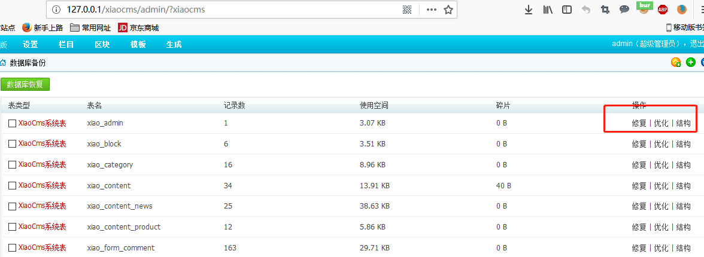
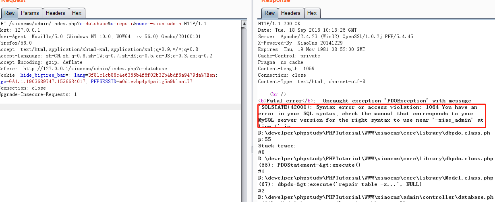

# xiaocms-SQL注入
xiaocms后台SQL注入  

在xiaocms\admin\controller\database.php第81，90，99行，db操作中，直接引用了$name，该变量使用get方法传递，继续跟进，此处备注为修复表，可以查看该功能。

In the xiaocms\admin\controller\database.php line 81, 90, 99, db operation, directly reference the $name, the variable is passed using the get method, continue to follow up, here the note is the repair table, you can view the function .

  
 
在xiaocms\core\library\base.class.php中69行，重写了get方法，使用了htmlspecialchars函数进行过滤，过滤单双引号，<>。

In line 69 of xiaocms\core\library\base.class.php, the get method is rewritten, and the htmlspecialchars function is used to filter, filtering single and double quotes, <>.

  
 
在后台找到该功能点，此处三处功能均存在注入漏洞。

The function point was found in the background, and there are injection holes in all three functions.

  
 
拦截数据包，参数前添加'，服务器返回SQL报错信息。

Intercept the packet, add before the parameter ', the server returns the SQL error message

  
 
使用sqlmap，跑出数据库，证明漏洞存在，设置参数为：python sqlmap.py -r postdata.txt -v 5 --tamper=apostrophenullencode.py,between.py,randomcase.py,apostrophemask.py

Use sqlmap to run out of the database and prove that the vulnerability exists. Set the parameters to: python sqlmap.py -r postdata.txt -v 5 --tamper=apostrophenullencode.py,between.py,randomcase.py,apostrophemask.py

  
